# PHASE 3 — Database Architecture
## سیستم مدیریت مالی، دارایی و ثروت شخصی
**وضعیت:** ✅ تکمیل‌شده — در انتظار تأیید شما
**تاریخ:** ۲۰۲۶-۰۹-۰۳
**شاخه:** `docs/phase-03-database.md`

---

## ۱. تصمیم‌های پایه‌ای (مطابق C2/C3/C1/C5/C11)

| تصمیم | قاعده |
|---|---|
| **پول** | همهٔ مبالغ `INTEGER` در «واحد جزء» (minor unit). تومان = خودِ عدد صحیح (بدون جزء). ارزهای دارای جزء (USD/EUR) = سنت. هیچ‌گاه `REAL`/اعشار. |
| **کمیت (Quantity)** | `INTEGER` یا `REAL` بنا بر دقت واحد؛ دقت در `asset_types.decimal_precision` ثبت می‌شود و مقادیر با `NUMERIC`/`REAL` + گرد‌کردن کنترل‌شده. |
| **کلیدها** | PK همگی `TEXT` (UUID). |
| **مالکیت** | همهٔ جدول‌های کاربری `user_id TEXT` دارند (Row-Level isolation). |
| **Soft delete** | ستون `is_deleted` + `deleted_at` برای همهٔ آیتم‌های مالی؛ حذف واقعی محدود. |
| **Audit/Replay** | تاریخچهٔ کامل Ledger + Aggregate Snapshot (C1). |
| **زمان** | ISO-8601 UTC؛ نمایش در timezone محلی. |
| **کد ملی/رویداد** | همهٔ Eventها `row_uuid` پایدار دارند تا Sync/SMS idempotent شود. |

**Typing summary:**
```
amount_minor   INTEGER   # مبلغ پول (minor unit)
quantity       REAL      # کمیت دارایی (گرم، سهم، ...)
unit_text      TEXT      # واحد (gram/dollar/share/piece/...)
price_minor    INTEGER   # قیمت واحد [برای پول] و به‌صورت REAL برای دارایی‌های غیرپول؟ → ذیل قیمت توضیح داده شد
```

> **نکتهٔ قیمت:** `price_minor` برای دارایی‌های پول‌محور؛ برای دارایی‌هایی که قیمت واحدشان ممکن است جزء اعشاری جدی داشته باشد (مثل نقره/طلا که در IRT با تومان معامله می‌شود) از `price_float REAL` + `decimal_precision` استفاده می‌شود. برای جلوگیری از `REAL`، تصمیم: **قیمت واحد به‌صورت `price_float REAL` + ذخیرهٔ اعشار به‌صورت `price_scaled_denominator`**. در فاز پیاده‌سازی، `decimal` با کتابخانهٔ دقیق (روی‌دانده) مدیریت می‌شود. این یک مصالحهٔ صادقانه‌ست که در «محدودیت‌ها/تصمیمات آتی» ثبت شده.

---

## ۲. دیاگرام ERD (Mermaid)

```mermaid
erDiagram
    users ||--o{ user_settings : has
    users ||--o{ accounts : owns
    users ||--o{ asset_types : defines
    users ||--o{ assets : owns
    users ||--o{ financial_events : creates
    users ||--o{ categories : has
    users ||--o{ tags : has
    users ||--o{ fee_rules : defines
    users ||--o{ debts : owes
    users ||--o{ receivables : entitled
    users ||--o{ loans : holds
    users ||--o{ checks : holds
    users ||--o{ budgets : sets
    users ||--o{ goals : sets
    users ||--o{ recurring : needs
    users ||--o{ sms_messages : receives
    users ||--o{ audit_logs : logs
    users ||--o{ sync_outbox : syncs

    asset_types ||--o{ assets : classifies
    assets ||--o{ asset_lots : contains
    assets ||--o{ price_history : priced_as
    asset_types ||--o{ price_history : priced_for
    asset_types ||--o{ fee_rules : rules_for
    price_sources ||--o{ price_history : supplies

    financial_events ||--o{ ledger_entries : produces
    financial_events ||--o{ transactions : details
    financial_events ||--o{ attachments : attaches
    financial_events ||--o{ event_tags : tagged
    tags ||--o{ event_tags : in

    accounts ||--o{ account_aggregates : aggregates
    assets ||--o{ asset_aggregates : aggregates
    debts ||--o{ liability_aggregates : aggregates
    receivables ||--o{ liability_aggregates : aggregates

    loans ||--o{ schedules : schedules
    debts ||--o{ schedules : schedules
    receivables ||--o{ schedules : schedules
    checks ||--o{ schedules : schedules
    recurring ||--o{ schedules : schedules

    goals ||--o{ goal_links : links
```



---

## ۳. جدول‌ها (Definitions)

### ۳.۱ هویت و تنظیمات

**`users`**
| ستون | نوع | قید/توضیح |
|---|---|---|
| id | TEXT | PK (UUID) |
| name | TEXT | NOT NULL |
| email_hash | TEXT NULL | برای Cloud (اختیاری) |
| phone_hash | TEXT NULL | برای Cloud/OTP (اختیاری) |
| avatar_path | TEXT NULL | |
| created_at | TEXT | |
| updated_at | TEXT | |

**`user_settings`** (بند ۸)
| ستون | نوع | توضیح |
|---|---|---|
| user_id | TEXT | PK, FK users |
| currency | TEXT | واحد پول اصلی (IRT/USD/EUR) |
| reference_asset | TEXT | واحد مرجع (toman / silver_g / gold_g / usd / eur) |
| date_format | TEXT | yyyy-MM-dd ... |
| decimal_precision | INTEGER | |
| theme_mode | TEXT | light/dark/system |
| accent_color | TEXT | |
| dashboard_widgets | TEXT (JSON) | چینش Widget ها (بند ۵۳) |
| show_asset_balances | TEXT (JSON) | نمایش/عدم نمایش برخی دارایی‌ها |
| app_lock_enabled | INTEGER | 0/1 |
| ai_enabled | INTEGER | 0/1 (بند ۷۹) |
| cloud_sync_enabled | INTEGER | 0/1 |
| notifications_config | TEXT (JSON) | بند ۶۱ |
| privacy_flags | TEXT (JSON) | بند ۶/۹۹ |
| updated_at | TEXT | |

### ۳.۲ حساب‌ها
**`accounts`** (بند ۳۹)
| ستون | نوع | توضیح |
|---|---|---|
| id | TEXT PK | |
| user_id | TEXT FK | |
| name | TEXT | |
| type | TEXT | CASH/BANK/WALLET/BUSINESS/OTHER |
| currency | TEXT | |
| balance_minor | INTEGER | موجودی فعلی (Snapshot) |
| owner | TEXT NULL | |
| notes | TEXT NULL | |
| status | TEXT | ACTIVE/ARCHIVED |
| sort_order | INTEGER | |
| is_deleted | INTEGER | soft delete + deleted_at |

**`account_aggregates`** (C1 — Aggregate)
| ستون | نوع | توضیح |
|---|---|---|
| account_id | TEXT PK FK | |
| balance_minor | INTEGER | |
| last_event_id | TEXT NULL | |
| updated_at | TEXT | |

### ۳.۳ دارایی (Generic)
**`asset_types`** (بند ۱۹/۲۰/۲۷)
| ستون | نوع | توضیح |
|---|---|---|
| id | TEXT PK | |
| user_id | TEXT FK | |
| code | TEXT | GOLD/SILVER/COIN/CURRENCY/STOCK/FUND/CRYPTO/PROPERTY/VEHICLE/BUSINESS/EQUIPMENT/CUSTOM |
| display_name | TEXT | |
| unit_default | TEXT | gram/dollar/share/token/piece/m2/vehicle/... |
| default_currency | TEXT | |
| liquidity_class | TEXT | LIQUID/SEMI_LIQUID/NON_LIQUID (C12) |
| supports_short | INTEGER | 0/1 (بند ۷۵) |
| decimal_precision | INTEGER | |
| metadata_schema | TEXT (JSON) | بند ۲۱ (karat/weight/area/...) |
| is_active | INTEGER | |
| created_at | TEXT | |

**`assets`** (بند ۱۹-۲۲)
| ستون | نوع | توضیح |
|---|---|---|
| id | TEXT PK | |
| user_id | TEXT FK | |
| asset_type_id | TEXT FK | |
| name | TEXT | |
| identifier | TEXT NULL | |
| unit | TEXT | |
| current_quantity | REAL | (Snapshot) |
| current_cost_basis_minor | REAL | (Snapshot) میانگین |
| cost_method | TEXT | AVG/FIFO/SPECIFIC (بند ۲۳) |
| metadata | TEXT (JSON) | بند ۲۱ |
| is_deleted | INTEGER | |
| created_at | TEXT | |

**`asset_lots`** (بند ۲۲)
| ستون | نوع | توضیح |
|---|---|---|
| id | TEXT PK | |
| asset_id | TEXT FK | |
| quantity | REAL | |
| unit_price | REAL | |
| cost_basis_sum | REAL | |
| opened_at | TEXT | |
| closed_at | TEXT NULL | |
| status | TEXT | OPEN/CLOSED |
| source_event_id | TEXT FK NULL | |

**`asset_aggregates`** (C1)
| ستون | نوع | توضیح |
|---|---|---|
| asset_id | TEXT PK FK | |
| quantity | REAL | |
| cost_basis_total | REAL | |
| market_value_minor | REAL | بر اساس آخرین قیمت |
| last_price | REAL NULL | |
| updated_at | TEXT | |

### ۳.۴ قیمت (بند ۲۷-۳۱)
**`price_sources`**
| ستون | نوع | توضیح |
|---|---|---|
| id | TEXT PK | |
| user_id | TEXT FK NULL | (NULL = سراسری/سیستمی) |
| code | TEXT | MANUAL/API/CSV/CHARISMA/CUSTOM |
| name | TEXT | |
| enabled | INTEGER | |
| priority | INTEGER | |
| config | TEXT (JSON) | (بدون hard-code endpoint) |
| last_fetch_at | TEXT NULL | |
| last_status | TEXT NULL | |
| created_at | TEXT | |

**`price_history`** (بند ۳۰/۵۷)
| ستون | نوع | توضیح |
|---|---|---|
| id | TEXT PK | |
| user_id | TEXT FK | |
| asset_type_id | TEXT FK | |
| asset_id | TEXT FK NULL | (اگر به دارایی خاص) |
| price_float | REAL | |
| price_minor | INTEGER NULL | برای پول محور |
| currency | TEXT | |
| unit | TEXT | |
| source_id | TEXT FK | |
| source_status | TEXT | LIVE/STALE/MANUAL |
| observed_at | TEXT | (زمان اندازه‌گیری) |
| created_at | TEXT | |

**`price_cache`** (بند ۳۱)
| ستون | نوع | توضیح |
|---|---|---|
| asset_type_id | TEXT PK FK | |
| asset_id | TEXT PK FK NULL | |
| last_price | REAL | |
| last_currency | TEXT | |
| last_observed_at | TEXT | |
| source_id | TEXT | |
| status | TEXT | LIVE/STALE |
| fetched_at | TEXT | |

**`price_overrides`** (بند ۳۸/۷۳)
| ستون | نوع | توضیح |
|---|---|---|
| id | TEXT PK | |
| user_id | TEXT FK | |
| asset_id | TEXT FK | |
| previous | REAL | |
| new_value | REAL | |
| reason | TEXT | |
| changed_at | TEXT | |

### ۳.۵ کارمزد (بند ۳۲-۳۶)
**`fee_rules`**
| ستون | نوع | توضیح |
|---|---|---|
| id | TEXT PK | |
| user_id | TEXT FK NULL | (NULL=Global) |
| scope | TEXT | GLOBAL/TYPE/ASSET/TRANSACTION/USER |
| asset_type_id | TEXT FK NULL | |
| asset_id | TEXT FK NULL | |
| kind | TEXT | PERCENT/FIXED/PERCENT_FIXED/MIN/MAX |
| value | REAL | |
| min | REAL | |
| max | REAL | |
| applies_to | TEXT | BUY/SELL/BOTH |
| time_start | TEXT NULL | "08:00" |
| time_end | TEXT NULL | "14:00" |
| day_of_week | INTEGER NULL | 0-6 |
| date_from | TEXT NULL | |
| date_to | TEXT NULL | |
| qty_from | REAL NULL | |
| qty_to | REAL NULL | |
| amount_from | REAL NULL | |
| amount_to | REAL NULL | |
| priority | INTEGER | (بند ۳۵) |
| enabled | INTEGER | |
| created_at | TEXT | |

### ۳.۶ رویداد / دفتر کل / تراکنش (بند ۱۴-۱۶، ۷۴، ۳۷-۳۸)
**`financial_events`**
| ستون | نوع | توضیح |
|---|---|---|
| id | TEXT PK | (row_uuid پایدار) |
| user_id | TEXT FK | |
| kind | TEXT | INCOME/EXPENSE/TRANSFER/ASSET_BUY/ASSET_SELL/ASSET_ADJUST/FEE/TAX/DEBT_CREATE/DEBT_PAY/RECEIVABLE_CREATE/RECEIVABLE_COLLECT/LOAN/INSTALLMENT/CHECK_ISSUED/CHECK_RECEIVED/CHECK_CLEARED/CHECK_RETURNED/REFUND/DISCOUNT/INTEREST/PENALTY/INVESTMENT/DIVESTMENT/OTHER |
| status | TEXT | ACTIVE/REVERSED |
| occurred_at | TEXT | |
| currency | TEXT | |
| total_amount_minor | INTEGER | (جمع، برای QuickCalc) |
| reference_event_id | TEXT FK NULL | (Reversal) |
| note | TEXT NULL | |
| tags | TEXT (JSON) NULL | |
| metadata | TEXT (JSON) NULL | |
| created_at | TEXT | |
| updated_at | TEXT | |
| is_deleted | INTEGER | |

**`ledger_entries`**
| ستون | نوع | توضیح |
|---|---|---|
| id | TEXT PK | |
| event_id | TEXT FK | |
| side | TEXT | DEBIT/CREDIT |
| account_id | TEXT FK NULL | |
| asset_id | TEXT FK NULL | |
| liability_id | TEXT FK NULL | (debt/receivable/loan) |
| amount_minor | INTEGER NULL | |
| quantity | REAL NULL | |
| unit | TEXT NULL | |
| currency | TEXT | |
| created_at | TEXT | |

**`transactions`** (جزئیات Screen)
| ستون | نوع | توضیح |
|---|---|---|
| id | TEXT PK | |
| event_id | TEXT FK | |
| user_id | TEXT FK | |
| kind | TEXT | EXPENSE/INCOME/TRANSFER/... |
| counterparty | TEXT NULL | |
| merchant | TEXT NULL | |
| category_id | TEXT FK NULL | |
| note | TEXT NULL | |
| from_account_id | TEXT FK NULL | |
| to_account_id | TEXT FK NULL | |
| amount_minor | INTEGER | |
| fee_minor | INTEGER NULL | |
| tax_minor | INTEGER NULL | |
| price_snapshot | TEXT (JSON) NULL | (unitPrice, source, ts) بند ۳۷ |
| fee_snapshot | TEXT (JSON) NULL | (feeRate, ruleId, amount) بند ۳۷ |
| manual_override | TEXT (JSON) NULL | (prev, new, reason, ts, flag) بند ۳۸ |
| created_at | TEXT | |
| updated_at | TEXT | |

**`categories`**
| ستون | نوع | توضیح |
|---|---|---|
| id | TEXT PK | |
| user_id | TEXT FK | |
| name | TEXT | |
| parent_id | TEXT FK NULL | |
| type | TEXT | INCOME/EXPENSE |
| icon | TEXT NULL | |
| color | TEXT NULL | |
| sort_order | INTEGER | |
| is_system | INTEGER | 0/1 |

**`tags`**
| id | name | (UNIQUE user_id+name) |

**`event_tags`**
| event_id | tag_id | (مزو) |

### ۳.۷ بدهی/طلب/وام/قسط/چک (بند ۴۵-۴۹؛ C5)
**`debts`**
| ستون | نوع | توضیح |
|---|---|---|
| id | TEXT PK | |
| user_id | TEXT FK | |
| creditor | TEXT | |
| principal_minor | INTEGER | |
| remaining_minor | INTEGER | |
| paid_minor | INTEGER | |
| currency | TEXT | |
| issued_at | TEXT | |
| due_date | TEXT NULL | |
| interest_rate | REAL NULL | |
| fee_minor | INTEGER NULL | |
| penalty_minor | INTEGER NULL | |
| status | TEXT | OPEN/PAID/OVERDUE |
| notes | TEXT NULL | |
| is_deleted | INTEGER | |

**`receivables`** (بند ۴۶)
| ستون | نوع | توضیح |
|---|---|---|
| id | TEXT PK | |
| user_id | TEXT FK | |
| debtor | TEXT | |
| principal_minor | INTEGER | |
| remaining_minor | INTEGER | |
| paid_minor | INTEGER | |
| currency | TEXT | |
| issued_at | TEXT | |
| due_date | TEXT NULL | |
| status | TEXT | OPEN/COLLECTED/OVERDUE |
| notes | TEXT NULL | |

**`loans`** (بند ۴۷)
| ستون | نوع | توضیح |
|---|---|---|
| id | TEXT PK | |
| user_id | TEXT FK | |
| direction | TEXT | BORROW/LEND |
| principal_minor | INTEGER | |
| interest_minor | INTEGER | |
| fee_minor | INTEGER | |
| remaining_minor | INTEGER | |
| paid_minor | INTEGER | |
| currency | TEXT | |
| disbursed_at | TEXT | |
| status | TEXT | OPEN/CLOSED |

**`schedules`** (موتور قسط مشترک — C5)
| ستون | نوع | توضیح |
|---|---|---|
| id | TEXT PK | |
| user_id | TEXT FK | |
| owner_type | TEXT | LOAN/INSTALLMENT/BNPL/DEBT/RECEIVABLE/CHECK/RECURRING |
| owner_id | TEXT | |
| kind | TEXT | DAILY/WEEKLY/MONTHLY/YEARLY/CUSTOM |
| frequency | INTEGER | |
| start_date | TEXT | |
| end_date | TEXT NULL | |
| amount_minor | INTEGER | |
| currency | TEXT | |
| next_due_at | TEXT NULL | |
| status | TEXT | ACTIVE/PAUSED/COMPLETED |
| created_at | TEXT | |

**`checks`** (بند ۴۹)
| ستون | نوع | توضیح |
|---|---|---|
| id | TEXT PK | |
| user_id | TEXT FK | |
| direction | TEXT | ISSUED/RECEIVED |
| amount_minor | INTEGER | |
| issue_date | TEXT | |
| due_date | TEXT | |
| counterparty | TEXT | |
| bank | TEXT NULL | |
| reference | TEXT NULL | |
| status | TEXT | PENDING/CLEARED/RETURNED/CANCELLED |
| notes | TEXT NULL | |
| is_deleted | INTEGER | |

**`liability_aggregates`** (C1)
| ستون | نوع | توضیح |
|---|---|---|
| entity_type | TEXT | DEBT/RECEIVABLE/LOAN |
| entity_id | TEXT | |
| remaining_minor | INTEGER | |
| paid_minor | INTEGER | |
| status | TEXT | |
| updated_at | TEXT | |

### ۳.۸ بودجه / هدف (بند ۵۹-۶۰)
**`budgets`**
| id, user_id, category_id, period, amount_minor, currency, status |
**`goals`**
| id, user_id, name, target_type(AMOUNT/QUANTITY), target_value, unit, current_value, target_date, status |
**`goal_links`**
| goal_id, entity_type(ASSET/ACCOUNT/RECEIVABLE), entity_id, weight |

### ۳.۹ پیوست / OCR (بند ۶۵-۶۶)
**`attachments`**
| id, user_id, owner_type(EVENT/ASSET), owner_id, file_path, mime, bytes, sync_status, created_at |

### ۳.۱۰ SMS و هوش محلی (بند ۴۱-۴۳)
**`sms_messages`**
| id, user_id, sms_id, sender, body_hash, parsed(JSON), match_status, duplicate_of, created_at |
| UNIQUE(user_id, sms_id) |

**`smart_rules`** (بند ۴۳)
| id, user_id, matcher_type(MERCHANT/REGEX/AMOUNT), pattern, action(category_id/direction/...), hit_count, enabled |
| UNIQUE(user_id, pattern) |

### ۳.۱۱ تکرارشونده (بند ۴۴)
**`recurring`**
| id, user_id, kind, category_id, amount_minor, schedule_id, cursor(JSON یا next_due), status |

### ۳.۱۲ Auditing / Sync / Backup (بند ۶۸-۹، ۷۳)
**`audit_logs`** (بند ۷۳)
| id, user_id, entity_type, entity_id, action, old_value(JSON), new_value(JSON), reason, changed_at, device_id |
| INDEX(user_id, entity_type, entity_id) |

**`sync_outbox`** (بند ۶۹؛ C6)
| id, user_id, entity_type, entity_id, op(CREATE/UPDATE/DELETE), revision, payload(JSON), state(PENDING/SYNCED/FAILED), conflict_log(JSON), synced_at |
| INDEX(user_id, state) |

**`backups`** (بند ۶۸)
| id, user_id, file_path, kind(LOCAL/CLOUD), created_at, restored_at |

---

## ۴. ایندکس‌ها (خلاصه و مهم)

| جدول | ایندکس | دلیل |
|---|---|---|
| financial_events | (user_id, occurred_at) | فهرست تراکنش‌ها سریع |
| financial_events | (user_id, kind, status) | فیلتر نوع |
| ledger_entries | (account_id) | موجودی حساب |
| ledger_entries | (asset_id) | موجودی دارایی |
| ledger_entries | (event_id) | بازیابی سند |
| transactions | (user_id, occurred_at) | گزارش/جستجو |
| transactions | (user_id, category_id) | پولم کجا رفت |
| transactions | (user_id, merchant) | Merchant matching |
| transactions | (user_id, note) | جستجوی متن (FTS/trigram بعداً) |
| price_history | (asset_type_id, observed_at) | As-of lookup (C3) |
| price_history | (asset_id, observed_at) | نمودار قیمت |
| debts/receivables | (user_id, status, due_date) | تقویم آینده |
| schedules | (user_id, next_due_at) | Forecast/اعلان |
| sms_messages | (user_id, sms_id) | Duplicate |
| smart_rules | (user_id, pattern) | Rule matching |
| audit_logs | (user_id, entity_type, entity_id) | Audit |
| sync_outbox | (user_id, state) | Sync worker |
| event_tags | (tag_id) | جستجوی تگ |
| attachments | (user_id, owner_type, owner_id) | پیوست |
| goals | (user_id, status) | اهداف |

---

## ۵. کنسترینت‌ها / قواعد (Constraints)

- **FK**: همهٔ روابط، `ON DELETE CASCADE` فقط برای join ها؛ برای آیتم‌های مالی معمولاً `RESTRICT` و soft delete (حفظ تاریخچه).
- **UNIQUE**: `tags(user_id,name)`، `app(sms)(user_id,sms_id)`, `smart_rules(user_id,pattern)`, `asset_types(user_id,code)` .
- **CHECK (Domain)**: قواعد در Domain اعمال می‌شود، ولی DB:
  - `assets.current_quantity >= 0` (مگر `supports_short=1` و flag).
  - `ledger` : مجموع Debit−Credit = 0 به‌صورت یک CHECK سنتی قابل محاسبه نیست (نیازمند چک‌آپ); لذا یک **integrity check post-commit** اجرا می‌شود (تست + اعتبارسنجی) و در Domain هم سخت‌گیرانه.
  - `financial_events.status IN ('ACTIVE','REVERSED')`.
  - `debt.status IN ('OPEN','PAID','OVERDUE')` ... .
- **Soft delete:** `is_deleted` + `deleted_at` روی آیتم‌های مالی. Deletions → Reversal Event.
- **Level of isolation:** هر پرس‌وجو باید `user_id` محدود باشد (row-level security). برای فاز ۷ با Drift در هر repository، `user_id` به‌صورت context برداشته می‌شود (نه فراموشی).

---

## ۶. استراتژی مایگریشن (Migration Strategy)

- **نسخه‌بندی:** Drift schema_version (user_version).
- **Migrations:** فایل `migration_plan.dart` با `MigrationStrategy`، هر نسخه→نسخه.
- **Backward-compatible:** اضافه‌کردن ستون/جدول، بدون Drop ستون کاربر (مگر مهاجرت صریح با بکاپ).
- **Atomic:** هر مایگریشن داخل یک Transaction.
- **Test:** تست مهاجرت (از نسخهٔ قبلی به جدید) با `sqflite_common_ffi` (بند ۹۶).
- **اولین مایگریشن** (v1=0 → v2=1) کل اسکیمای فعلی را می‌سازد.
- **Seed:** دسته‌ها و asset_types پیش‌فرض + تنظیمات پیش‌فرض.
- **بکاپ قبل از میگ‌ر** پیشنهاد می‌شود (بند ۶۸).

---

## ۷. تصمیمات/محدودیت‌های باز (Open Decisions — برای فاز ۷/۱۰)

| موضوع | تصمیم فعلی | تصمیم نهایی در |
|---|---|---|
| اعشار قیمت دارایی‌ها | مصالحهٔ `price_float REAL` | فاز ۱۰ (Pricing) — بازبینی و گزینهٔ Decimal/Double دقیق |
| FTS جستجوی متن | پیش‌بینی‌شده، نه هنوز | فاز ۱۲/جستجو |
| Sync conflict granularity | رکوردمحور LVW | فاز ۱۵ (Sync) |
| Encryption granularity | کل DB (SQLCipher) | فاز ۱۵ |
| منبع قیمت تاریخی | سازوکار آماده در Price_Source/History | فاز ۱۰ |

---

## ۸. معیار Done فاز ۳

- [x] تصمیم‌های پایه‌ای (Integer/Unit/Soft delete/Row isolation/C1/C5/C11)
- [x] ERD (Mermaid)
- [x] همهٔ جدول‌ها با ستون/نوع/کلید/قید
- [x] ایندکس‌ها (همهٔ پرس‌وجوهای اصلی)
- [x] کنسترینت‌ها و قواعد درستی
- [x] استراتژی مایگریشن + Seed + تست مهاجرت
- [x] تصمیمات باز مشخص شده

---

## ۹. گزارش پایان فاز ۳ (بند ۱۱۱)

1. **ساخته شد:** ERD کامل + تعریف ۳۰+ جدول + ایندکس + قید + استراتژی مایگریشن.
2. **فایل:** `docs/phase-03-database.md`.
3. **Schema:** همان ۳۰+ جدول تشریح‌شده (هویت، حساب، دارایی، قیمت، کارمزد، رویداد/دفتر/تراکنش، بدهی/طلب/وام/قسط/چک، بودجه/هدف، پیوست، SMS، تکرارشونده، Audit/Sync/Backup, Aggregateها).
4. **تصمیمات معماری:** Integer Money، UUID، Row isolation، Soft delete، Aggregate+Replay، As-of Price، موتور Schedule مشترک، Migration versioned.
5. **تست:** تست مهاجرت در فاز ۷ (نگارش). تست Domain در فاز ۸.
6. **مشکلات:** بازبودن دقت اعشار قیمت دارایی (ثبت در بخش ۷).
7. **باقی‌مانده:** فاز ۴ — Design System.
8. **پیشنهادها:** در فاز ۴ سیستم رنگی/نوع‌شناسی/فضا؛ در فاز ۷ پیاده‌سازی Drift.
9. **ناسازگاری:** هیچ؛ با C1-C12 و فازهای ۱-۲ هم‌راستا.

---

✅ **فاز ۳ کامل شد. نیازمند تأیید برای رفتن به فاز ۴ (Design System) هستم.**
